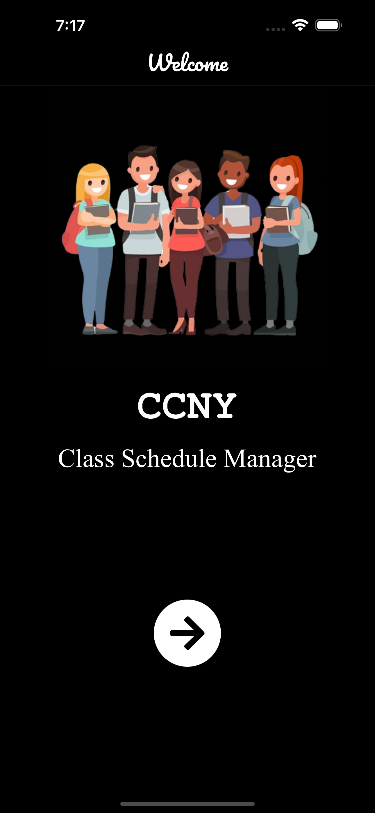
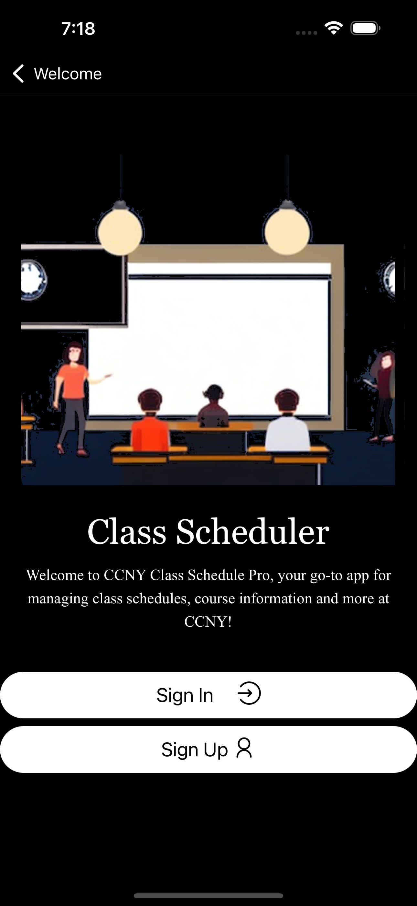
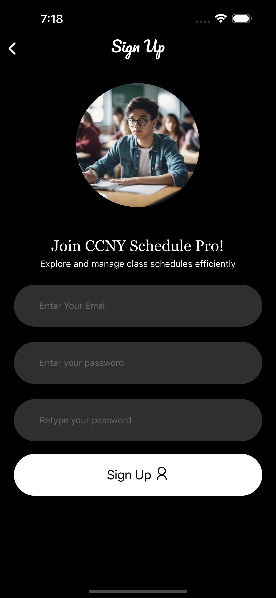
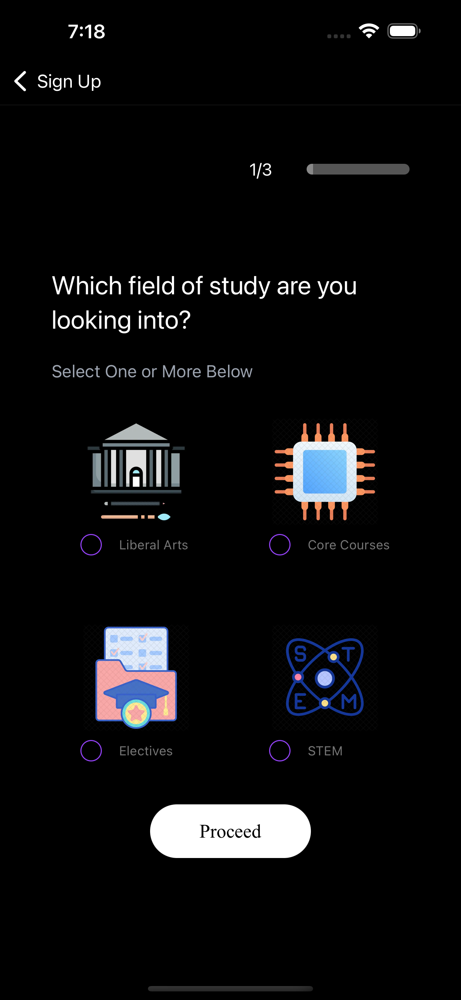
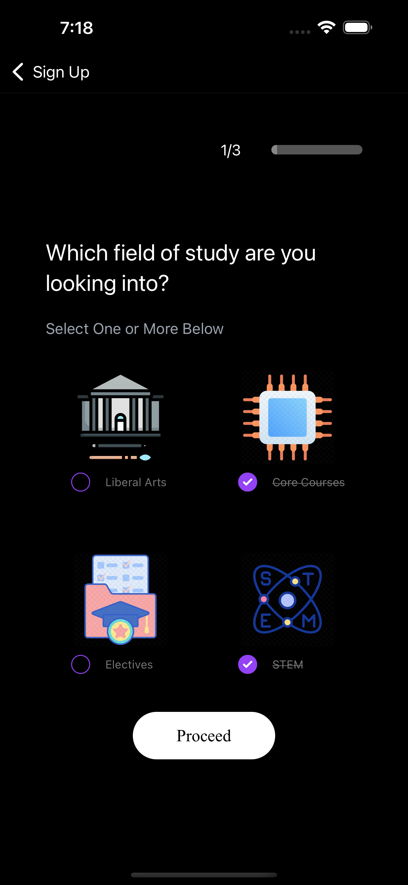
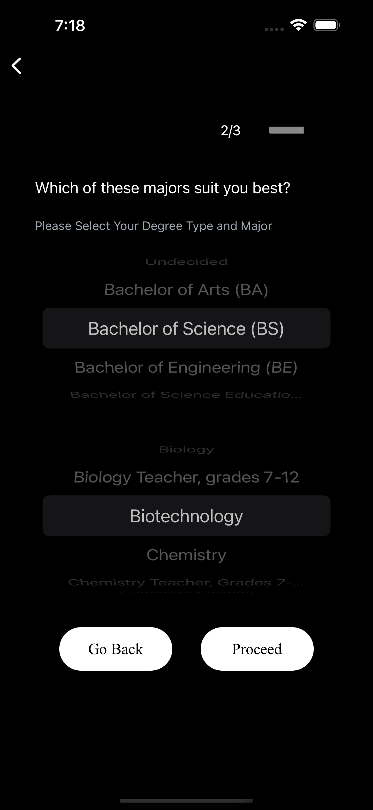
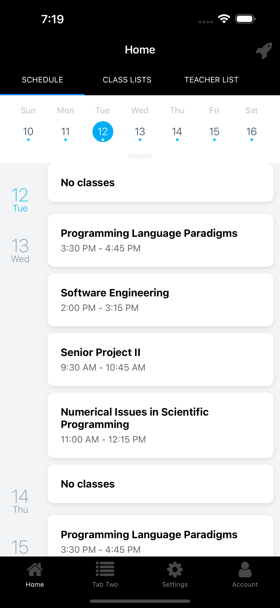
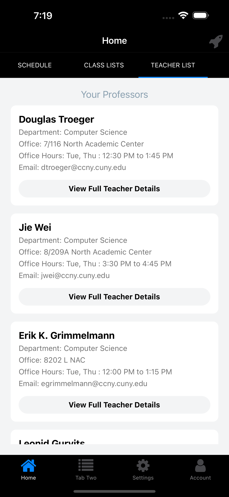

# CCNY Schedule Pro

## Description

A project that has been development as part of my senior design 2 course.
The intention of this is to replace the dependency on rate my professor.

Alongside providing features similar to Google Calendar and Discord.

Features Includes but not Limited To:

- Create Schedules
- Set notificaiton reminders
- List of classes being offered per semester
- Most recent comments regarding particular professor from Rate My Professor
- Filter Professors by Department
- Determine difficulty level of course based on sentiment analysis model
- multi-chat communication amongst various groups/departments

Following Are Links for Contact, to report Bugs/Feature Enhancements:

**Email**: [Dasa60196@gmail.com](Dasa60196@gmail.com)
**Discord**: the1sand0s

### Built With

- 

- 

- 

- 

- 

- 

- 

- 

- 

- 

- 

- 

- 

## Getting Started

If you would like to locally rn the project, please follow the instructions below

### Installation

Ensure that npm's version is up to date (Recommended : Yarn)

- npm

```sh
  npm install npm@latest -g
```

- Clone the repo

```sh
  git clone https://github.com/DeveloperMindset123/CCNY_SchedulePro.git
```

- Install the packages

```sh
  yarn install
```

- Enter the following values in `.env` (Modify as needed)
   **NOTE**: Link below provides postgres and primsa middleware setup instruction:

  [prisma+postgres_setup](https://www.prisma.io/docs/orm/overview/databases/postgresql)

  Additionally, the encryption and decryption key should remain the same.

   ```basic
   DATABASE_URL="your postgres SQL database URL"
   JWT_ACCESS_SECRET=ANY_RANOMD_SECRET_KEY_DONT_SHARE
   JWT_REFRESH_SECRET=ANY_RANDOM_REFRESH_SECRET_DONT_SHARE
   ENCRYPTION_KEY=SOME_ENRYPTION_KEY
   DECRYPTION_KEY=SOME_ENCRYPTION_KEY
   ```

- Change git remote url to avoid accidental pushes to base project

```sh
   git remote set-url origin github_username/repo_name
   git remote -v # confirm the changes
```

### Screenshots (of current project)

















